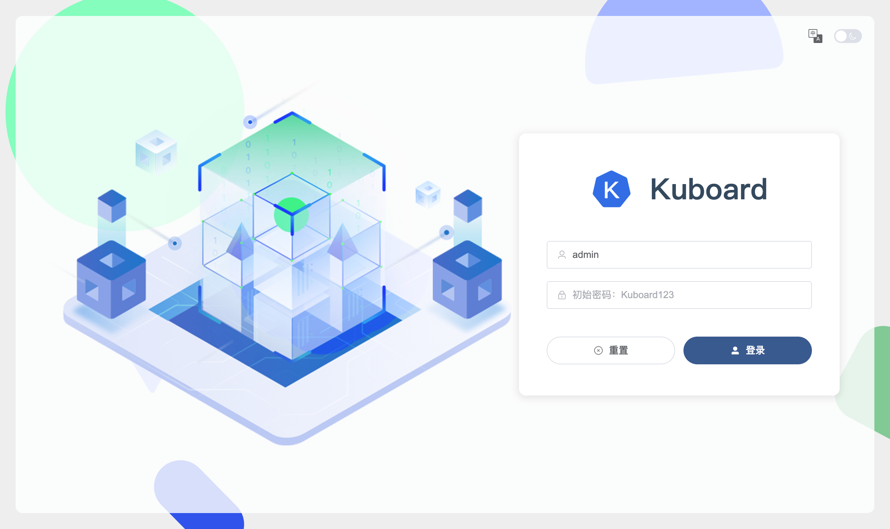
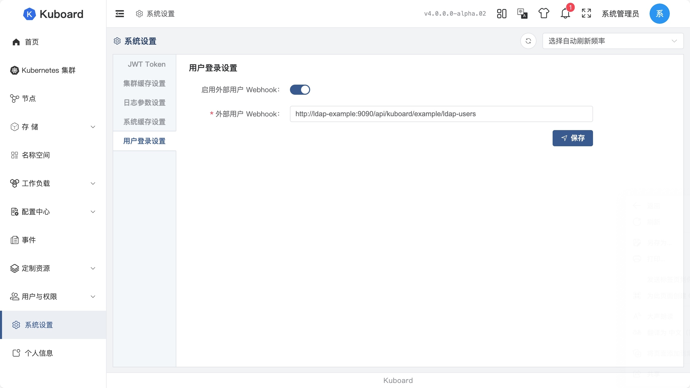
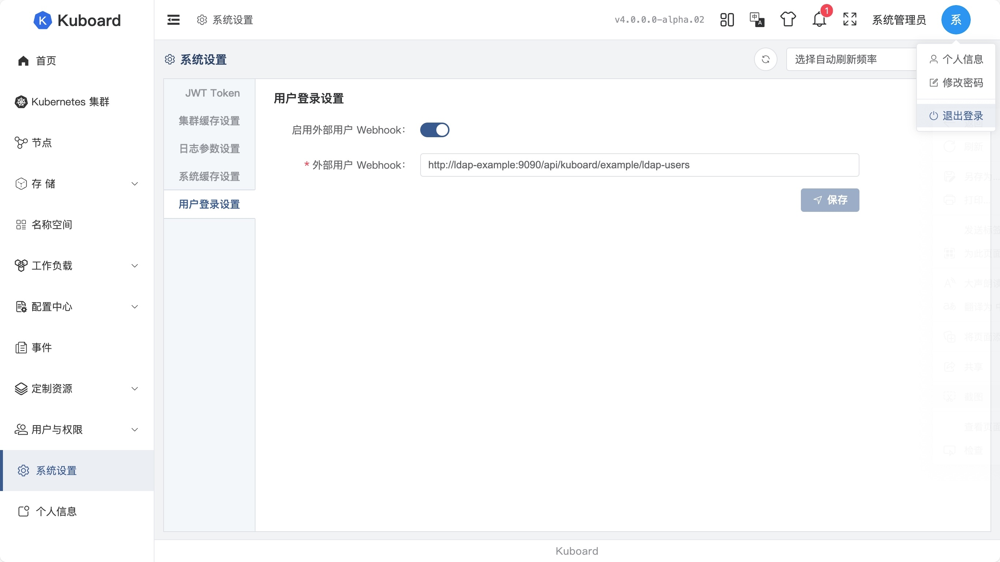
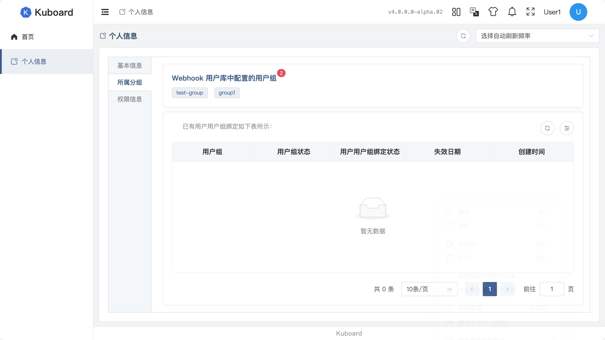

# Kuboard v4 Ldap example

This project is a example to show how to authenticate Kuboard v4 via LDAP server.

Kuboard v4 has a Service Provider Interface to authenticate user and load user details info.


## Prerequisit

To run the example, you have to prepare:
* docker engine >= 20.01


## Run the example

* Execute the following command in the source code root directory.

  ```sh
  git clone https://github.com/eip-work/kuboard-v4-ldap-example.git
  cd kuboard-v4-ldap-example
  docker compose up -d
  ```

* Open the following url in your browser

  `http://localhost:8000`

  

* Login with admin user:

  * username: `admin`
  * password: `Kuboard123`

* Navigate to `系统设置` -> `用户登录设置`: <br>
  Navigate to `System Settings` -> `User Authentication Settings` Menu:

  

  * Enable `启用外部用户 Webhook`<br>
    Enable `Enable External User Respository`
  * Fill in `外部用户 Webhook`<br>
    Fill in `External User Respository Webhook`
    with value `http://ldap-example:9090/api/kuboard/example/ldap-users`
  * Click `保存` button<br>
    Click `Save` button

* Logout with the button on the top right of the screen.

  

* Login with Ldap user:

  * username: `user01`
  * password: `password1`

  or 

  * username: `user02`
  * password: `password2`

* Navigate to `个人信息` -> `所属分组`: <br>
  Navigate to `Profile` -> `User Groups` Menu:

  

  We can see that `user01` derives two group bindings from webhook api, `test-group` and `group1`. We could also get to know from menu `个人信息` -> `权限信息` (`Profile` -> `Privileges`) that `user01` has no privilege to do anything at the moment.

  To grant `user01` with privileges, take the following actions:
  * Login with user `admin`
  * Navigate to menu `用户与权限` -> `用户组` (`Users and Roles` -> `Groups`)
  * Create a group named `test-group` (or `group1`)
  * Bind the group with proper roles.

  You can also grant `user01` with privileges by taking following actions:
  * Login with user `admin`
  * Navigate to menu `用户与权限` -> `用户组` (`Users and Roles` -> `Groups`)
  * Click a existing group which has proper privileges
  * Bind the group with user `user01`

## Build the example

* Execute the following command in the source code root directory.

  ```sh
  docker build -t eipwork/kuboard-v4-ldap-example:v4 .
  ```